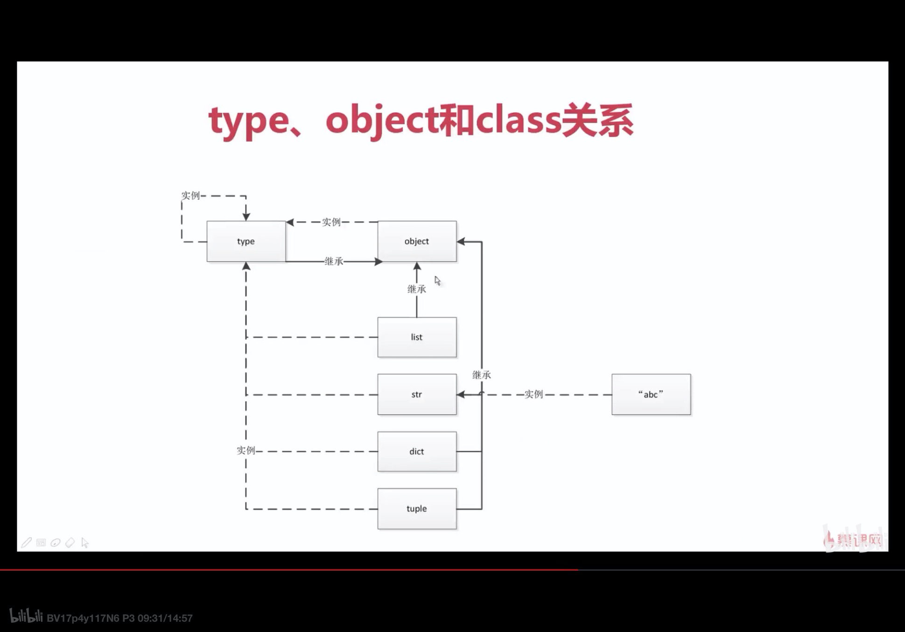

# python高级

## 面向对象

### 1.python中一切皆对象

函数和类也是对象,这是和java,c++不同的.注意括号的使用

```python
def func(name):
    print(name)

class cls():

    def __init__(self) -> None:
        print("xuan")

myFunc=func
myFunc('xiao')

myClass=cls
myClass()
```

```shell
xiao
xuan
```

可以被加载进列表,也可以作为函数参数,注意括号

```python
mylist = []
mylist.append(func)
mylist.append(cls)
for i in mylist:
    print(i)
    print(i())
```

```shell
<function func at 0x1058e3ea0>
wen
None
<class '__main__.cls'>
xuan
<__main__.cls object at 0x10d568668>
```

函数也可以作为函数的返回值(装饰器原理)

```python
def decorator():
    print("decorator")
    return func

func_2=decorator()
func_2("i have been decoratored")
```

```shell
decorator
i have been decoratored
```

### 2.type class object关系和区别

type->class对象

```python
a=1
b="abc"
print(type(1))
print(type(a))
print(type(int))
```

```shell
<class 'int'>
<class 'int'>
<class 'type'>

#type -> int ->1
```

class对象由type生成,包括python内置数据结构都是

```python
class Student():
    pass

stu = Student()
print(type(stu))
print(type(Student))

a = [1, 2, 3]
print(type(a))
print(type(list))
```

```shell
<class '__main__.Student'>
<class 'type'>

<class 'list'>
<class 'type'>
```

object是顶层基类,他的父类为空( ) . 不指定class对象的基类,那么该class对象都由object派生而来

```python
print(object.__bases__)
print(type(object))
print(type.__bases__)
```

```shell
()
<class 'type'>
(<class 'object'>,)
```

```python
print(Student.__bases__)
```

```shell
(<class 'object'>,)
```



总结:

1.type() 对所有的class对象到底都是type,包括object

2.所有的class对象的基类__bases__都是object

### 3.内置类型(内置class对象)

对象由三个信息组成:地址,类型,值

```python
a=1
id(a)	#地址
type(a)	#类型
a	#1就是a指向的值
```

#### None

None是解释器中唯一的对象,所以地址相同

```python
a=None
b=None
print(a==b)	#True
print(id(a)==id(b)) #True
```

#### 数值

float int complex bool

#### 迭代类型

只要对象实现了next iter方法就可以称作迭代类型（只实现iter叫做可迭代iterable，同时实现iter next叫做迭代器iterator）

可以使用for进行迭代

class对象可以实现getItem方法，可以将class生成的对象变成可迭代的

#### 序列类型

list bytes bytesarray memoryview  range tuple str array

通过实现getitem，setitem，delitem就可以将该对象转换为序列类型

#### 映射类型

dict

#### 集合

set frozenset

#### 上下文管理器

with

### 4.抽象基类

与鸭子类型的区别就是，鸭子类型不需要指定共同的基类，鸭子类型本身语言就是动态的

```python
class dog():
    def say(self):
        print("dog")


class cat():

    def say(self):
        print("cat")


class duck():
    def say(self):
        print("duck")


ani_list = [dog, cat, duck]
for i in ani_list:
    i().say()
```

```
dog
cat
duck
```

抽象基类两种使用场景

1.某些情况下需要判断某个对象的类型

```python
from collections import abc
```

包含如下的抽象基类

```python
__all__ = ["Awaitable", "Coroutine",
           "AsyncIterable", "AsyncIterator", "AsyncGenerator",
           "Hashable", "Iterable", "Iterator", "Generator", "Reversible",
           "Sized", "Container", "Callable", "Collection",
           "Set", "MutableSet",
           "Mapping", "MutableMapping",
           "MappingView", "KeysView", "ItemsView", "ValuesView",
           "Sequence", "MutableSequence",
           "ByteString",
           ]
```

每个抽象基类都包含subclasshook，用来判断是否为内置类型或者是否实现了某些魔法函数

```python
@classmethod
def __subclasshook__(cls, C):
  if cls is Sized:        
      return _check_methods(C, "__len__")    
  return NotImplemented
```

```python
class imp(base):

    def get(self):
        print("imp get")

    def set(self):
        print("imp set")

    def __len__(self):
        return 6
from _collections_abc import *
print(isinstance(imp(),Sized)) #True
```

2.需要强制某些子类实现特定的方法（原生也可以通过raise NotImplentedError来实现）

abc实现

```python
import abc
from abc import abstractmethod, ABCMeta


class base(metaclass=ABCMeta):
    @abstractmethod
    def get(self):
        print("get")

    @abstractmethod
    def set(self):
        print("set")


class imp(base):

    def get(self):
        print("imp get")

    def set(self):
        print("imp set")
imp().get()
```

raise error实现

```python
class base:
    def get(self):
        raise NotImplementedError
class imp(base):
    def set(self):
        print("set")

imp().get()
```

```shell
Traceback (most recent call last):
  File "/home/user/github/YOLOv3_TensorFlow2/test.py", line 17, in <module>
    imp().get()
  File "/home/user/github/YOLOv3_TensorFlow2/test.py", line 12, in get
    raise NotImplementedError
NotImplementedError
```

raise方法只有当调用get方法时才会报错

### 5.魔法函数

本质上是为了方法的重载，主要的魔法函数：

```python
构造析构：
object.__new__(self, ...)
object.__init__(self, ...)
object.__del__(self)

二元操作符：
+	object.__add__(self, other)
-	object.__sub__(self, other)
*	object.__mul__(self, other)
//	object.__floordiv__(self, other)
/	object.__div__(self, other)
%	object.__mod__(self, other)
**	object.__pow__(self, other[, modulo])
<<	object.__lshift__(self, other)
>>	object.__rshift__(self, other)
&	object.__and__(self, other)
^	object.__xor__(self, other)
|	object.__or__(self, other)

扩展二元操作符：
+=	object.__iadd__(self, other)
-=	object.__isub__(self, other)
*=	object.__imul__(self, other)
/=	object.__idiv__(self, other)
//=	object.__ifloordiv__(self, other)
%=	object.__imod__(self, other)
**=	object.__ipow__(self, other[, modulo])
<<=	object.__ilshift__(self, other)
>>=	object.__irshift__(self, other)
&=	object.__iand__(self, other)
^=	object.__ixor__(self, other)
|=	object.__ior__(self, other)

一元操作符：
-	object.__neg__(self)
+	object.__pos__(self)
abs()	object.__abs__(self)
~	object.__invert__(self)
complex()	object.__complex__(self)
int()	object.__int__(self)
long()	object.__long__(self)
float()	object.__float__(self)
oct()	object.__oct__(self)
hex()	object.__hex__(self)
round()	object.__round__(self, n)
floor()	object__floor__(self)
ceil()	object.__ceil__(self)
trunc()	object.__trunc__(self)

比较函数：
<	object.__lt__(self, other)
<=	object.__le__(self, other)
==	object.__eq__(self, other)
!=	object.__ne__(self, other)
>=	object.__ge__(self, other)
>	object.__gt__(self, other)

类的表示、输出：
str()	object.__str__(self) 
repr()	object.__repr__(self)
len()	object.__len__(self)
hash()	object.__hash__(self) 
bool()	object.__nonzero__(self) 
dir()	object.__dir__(self)
sys.getsizeof()	object.__sizeof__(self)

类容器：
len()	object.__len__(self)
self[key]	object.__getitem__(self, key)
self[key] = value	object.__setitem__(self, key, value)
del[key] object.__delitem__(self, key)
iter()	object.__iter__(self)
reversed()	object.__reversed__(self)
in操作	object.__contains__(self, item)
字典key不存在时	object.__missing__(self, key)
```

#### __init __ __new __  __del __

__init __  方法是Python最基本的魔术方法，通过此方法我们可以定义一个对象的初始操作，实际上它背后还有一个__new __方法。__new __是用来创建类并返回这个类的实例, 而__init __只是将传入的参数来初始化该实例。
对象生命周期调用结束时，__del __ 方法会被调用。

#### __getitem__ __setitem__ __delitem__

如果我们想实现创建类似于序列和映射的类，可以通过重写魔法方法__getitem__、__setitem__、__delitem__、__len__方法去模拟。

为class生成可迭代对象iterable，并且可以序列化，可以切片

```python
class Company(object):
    def __init__(self, employee_list) -> None:
        self.employee = employee_list

    def __getitem__(self, item):
        return self.employee[item]

    def __setitem__(self, key, value):
        self.employee[key] = value

    def __delitem__(self, key):
        del self.employee[key]

    def __len__(self):
        return len(self.employee)


company = Company(["xiao", "wen", "xuan"])
for i in company:
    print(i)
print(company[:-2])
company[1] = "dada"
del company[1]
```

```shell
xiao
wen
xuan
['xiao']
```

#### __len__

len()调用的是对象的len方法

```python
class Company:
    def __init__(self, employee_list) -> None:
        self.employee = employee_list

    def __getitem__(self, item):
        return self.employee[item]

    def __len__(self):
        return len(self.employee)

company = Company(["xiao", "wen", "xuan"])
print(len(company))
```

#### __str__ __repr__

str()主要面向用户，其目的是可读性，返回形式为用户友好性和可读性都较强的字符串类型；而repr()面向的是Python解释器，或者说开发人员，其目的是准确性，其返回值表示Python解释器内部的含义，常作为编程人员debug用途。

在解释器中直接输入a时调用repr()函数，而`print(a)`则调用str()函数。

repr()的返回值一般可以用`eval()`函数来还原对象，通常来说有如下等式。

```python
obj == eval(repr(obj))
```

#### __hash__


#### __iter__ __next__

迭代器，常见的就是我们在使用`for`语句的时候，python内部其实是把`for`后面的对象上使用了内建函数`iter`

```python
a = [1, 2, 3]
for i in a:
    do_something()
```

其实在python内部进行了类似如下的转换：

```python
a = [1, 2, 3]
for i in iter(a):
    do_something()
```

iter返回的是什么呢，就是一个迭代对象，它主要映射到了类里面的__iter__函数，此函数返回的是一个实现了__next__的对象。

Iterable: 有迭代能力的对象，一个类，实现了__iter__，那么就认为它有迭代能力，通常此函数必须返回一个实现了__next__的对象，如果自己实现了，你可以返回self，当然这个返回值不是必须的；
Iterator: 迭代器(当然也是Iterable)，同时实现了__iter__和__next__的对象，缺少任何一个都不算是Iterator

```python
class MyRange(object):
    def __init__(self, end):
        self.start = 0
        self.end = end

    def __iter__(self):
        return self

    def __next__(self):
        if self.start < self.end:
            ret = self.start
            self.start += 1
            return ret
        else:
            raise StopIteration
a = MyRange(5)
print(isinstance(a, Iterable))
print(isinstance(a, Iterator))

for i in a:
    print(i)
```

```shell
True
True
0
1
2
3
4
```

next方法调用实例对象的next方法

```
next(a)
```

可以看见一个很明显的好处是，每次产生的数据，是产生一个用一个，什么意思呢，比如我要遍历`[0, 1, 2, 3.....]`一直到10亿，如果使用列表的方式，那么是会全部载入内存的，但是如果使用迭代器，可以看见，当用到了(也就是在调用了`next`)才会产生对应的数字，这样就可以节约内存了，这是一种懒惰的加载方式。

### 6 isinstance type区别

判断类型是否一致

```python
#imp继承base
b = imp()
print(type(b) is imp)	#True
print(type(b) is base)	#False
print(isinstance(b, imp)) 	#True
print(isinstance(b, base))	#True
```

### 7.is ==

is判断对象的id是否相等

==判断值是否相等

### 8.staticmethod 	classmethod 	abstractmethod

静态方法：

```python
class static():
    @staticmethod
    def a():
        pass
static.a()
```

类方法：

```python
class cls():
    @classmethod
    def a(cls):
        pass
cls.a()
```

抽象方法：

```python
class base(metaclass=ABCMeta):
    @abstractmethod
    def get(self):
        print("get")
```

### 9.私有属性

```python
class A:
    def __init__(self):
        self.__name="xiao"
    def get_name(self):
        print(self.__name)
a=A()
a.get_name()
print(a._A__name)
```

对于具有双下划线开头的属性，python会转化该属性为

```
_ClassName__attr
```

的格式，所以python不是绝对安全的和绝对私有封装的

10.