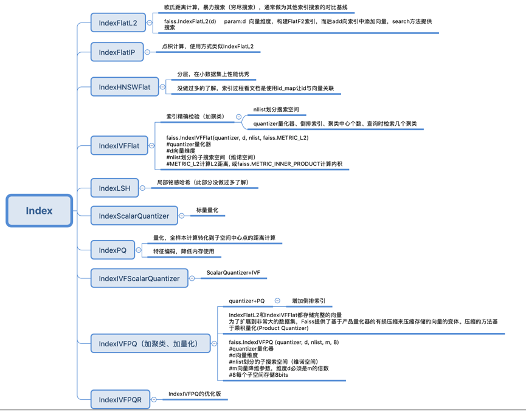

# faiss

## 介绍

Faiss是Facebook AI团队开源的针对聚类和相似性搜索库，为稠密向量提供高效相似度搜索和聚类，支持十亿级别向量的搜索，是目前最为成熟的近似近邻搜索库。它包含多种搜索任意大小向量集（备注：向量集大小由RAM内存决定）的算法，以及用于算法评估和参数调整的支持代码。Faiss用C++编写，并提供与Numpy完美衔接的Python接口。除此以外，对一些核心算法提供了GPU实现。

## 安装

```
conda install faiss-cpu -c pytorch
conda install faiss-gpu -c pytorch
```

## 功能说明

faiss的主要功能就是相似度搜索。以图片搜索为例，所谓相似度搜索，便是在给定的一堆图片中，寻找出我指定的目标最像的K张图片，也简称为KNN（K近邻）问题。

## 组件

Faiss中最常用的是索引Index，而后是PCA降维、PQ乘积量化



索引的创建提供了工厂方法，可以通过字符串灵活的创建不同的索引。

```
index = faiss.index_factory(d,"PCA32,IVF100,PQ8 ")
```

使用PCA算法将向量降维到32维, 划分成100个nprobe (搜索空间), 通过PQ算法将每个向量压缩成8bit。

