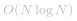

#### 方法一：排序

**思路与算法**

创建一个新的数组，它每个元素是给定数组对应位置元素的平方，然后排序这个数组。

```java [Wb3MJzFg-Java]
class Solution {
    public int[] sortedSquares(int[] A) {
        int N = A.length;
        int[] ans = new int[N];
        for (int i = 0; i < N; ++i)
            ans[i] = A[i] * A[i];

        Arrays.sort(ans);
        return ans;
    }
}
```
```python [Wb3MJzFg-Python]
class Solution(object):
    def sortedSquares(self, A):
        return sorted(x*x for x in A)
```


**复杂度分析**

* 时间复杂度： ，其中 *N* 是数组 `A` 的长度。

* 空间复杂度：*O(N)*。


---
#### 方法二：双指针

**思路**

因为数组 `A` 已经排好序了， 所以可以说数组中的负数已经按照平方值降序排好了，数组中的非负数已经按照平方值升序排好了。

举一个例子，若给定数组为 `[-3, -2, -1, 4, 5, 6]`，数组中负数部分 `[-3, -2, -1]` 的平方为 `[9, 4, 1]`，数组中非负部分 `[4, 5, 6]` 的平方为 `[16, 25, 36]`。我们的策略就是从前向后遍历数组中的非负数部分，并且反向遍历数组中的负数部分。

**算法**

我们可以使用两个指针分别读取数组的非负部分与负数部分 —— 指针 `i` 反向读取负数部分，指针 `j` 正向读取非负数部分。

那么，现在我们就在使用两个指针分别读取两个递增的数组了（按元素的平方排序）。接下来，我们可以使用双指针的技巧合并这两个数组。

```java [7tEz5BZk-Java]
class Solution {
    public int[] sortedSquares(int[] A) {
        int N = A.length;
        int j = 0;
        while (j < N && A[j] < 0)
            j++;
        int i = j-1;

        int[] ans = new int[N];
        int t = 0;

        while (i >= 0 && j < N) {
            if (A[i] * A[i] < A[j] * A[j]) {
                ans[t++] = A[i] * A[i];
                i--;
            } else {
                ans[t++] = A[j] * A[j];
                j++;
            }
        }

        while (i >= 0) {
            ans[t++] = A[i] * A[i];
            i--;
        }
        while (j < N) {
            ans[t++] = A[j] * A[j];
            j++;
        }

        return ans;
    }
}
```
```python [7tEz5BZk-Python]
class Solution(object):
    def sortedSquares(self, A):
        N = len(A)
        # i, j: negative, positive parts
        j = 0
        while j < N and A[j] < 0:
            j += 1
        i = j - 1

        ans = []
        while 0 <= i and j < N:
            if A[i]**2 < A[j]**2:
                ans.append(A[i]**2)
                i -= 1
            else:
                ans.append(A[j]**2)
                j += 1

        while i >= 0:
            ans.append(A[i]**2)
            i -= 1
        while j < N:
            ans.append(A[j]**2)
            j += 1

        return ans
```


**复杂度分析**

* 时间复杂度：*O(N)*，其中 *N* 是数组 `A` 的长度。
* 空间复杂度：*O(N)*。
  

  
