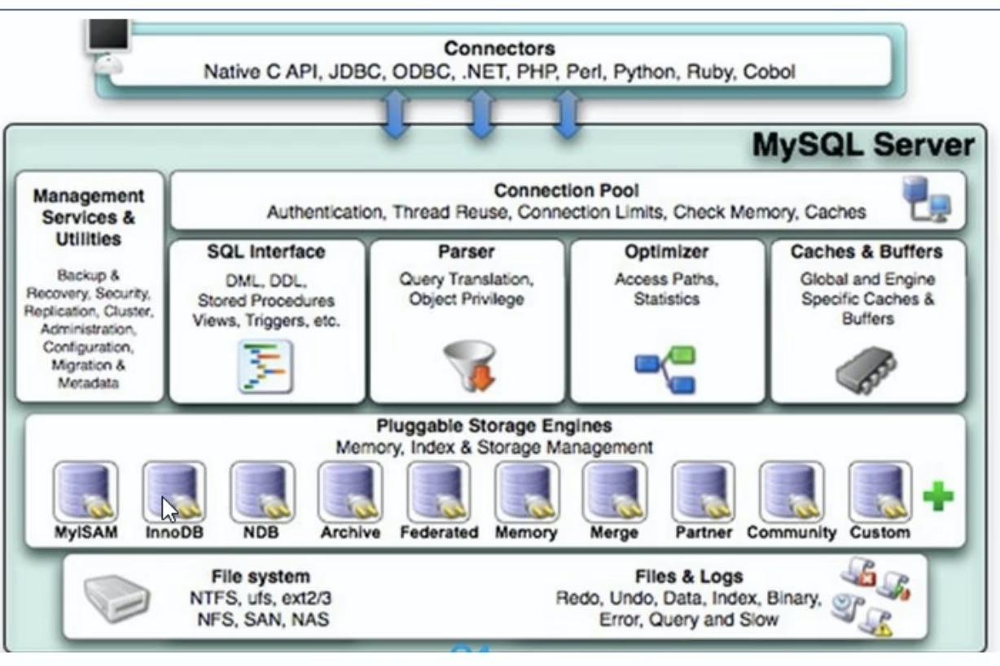
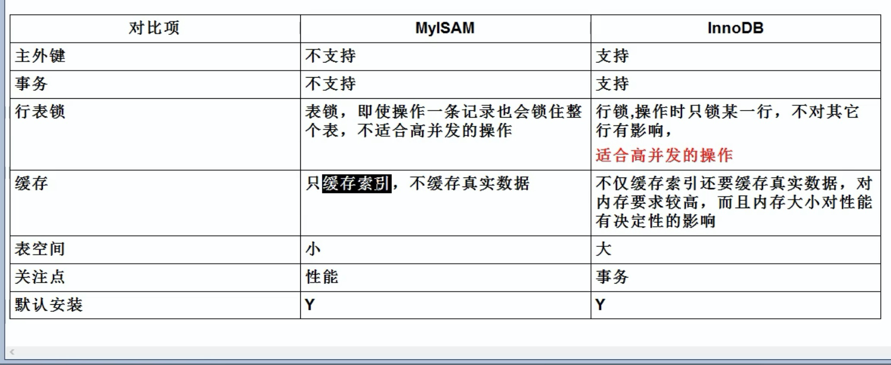

# MySql

## 客户端登陆

```mysql
mysql -h localhost -P 3306 -u root -p
```

## 基本命令

```mysql
desc tablename; //查看表结构
use databasename
show basename tablename
create table
create database
select database() version()
```

## 基本数据类型

### 数值型

#### 整型

默认是有符号的,使用unsigned来规定为无符号,如果超出范围,会设置为临界值

|    类型     | 字节数 |
| :---------: | :----: |
|   tinyint   |   1    |
|  smallint   |   2    |
|  mediumint  |   3    |
| Int/integer |   4    |
|   bigint    |   8    |

#### 浮点型

|  类型  | 字节数 |
| :----: | :----: |
| float  |   4    |
| double |   8    |

```sql
float(5,2)	//小数点后面为2位,总长度为5
// 浮点型默认无精度
```

#### 定点型

|    类型    | 字节 |
| :--------: | :--: |
| dec/decmal | M+2  |

```sql
//dec默认精度(10 , 0)
//定点型精度较高
//dec(M,D);
```

### 字符型

较长的文本text bolb(二进制) ;较短的文本char , varchar

|       类型        | 字符数 |
| :---------------: | :----: |
|      char(M)      |   M    |
|    varchar(M)     |   M    |
|     binary(M)     |   M    |
|   varbinary(M)    |   M    |
| enum(‘a’,'b','c') |        |
|        set        |        |

//char固定长度,空间消耗高;varchar反之

//binary/varbinary保存二进制字符串

//enum枚举,不区分大小写,只可插入枚举之内的字符串,set不同的是可以多个,enum只能一个

### 日期型

|   类型    | 字节 |
| :-------: | :--: |
|   date    |  4   |
| datetime  |  8   |
| timestamp |  4   |
|   time    |  3   |
|   year    |  1   |

## DQL

data query language 数据查询语句

### 基础查询

```sql
select field1,field2 from tablename;
select * from tablename;

//重命名
select field1 as f1 ,field2 as f2 from tablename;
select field1 f1 ,field2 f2 from tablename;
select field1 as f1 from tablename as tn;
//去重 distinct
select distinct field from tablename;

//排除null
select ifnull(field1,0) from tablename;

//拼接( + 会转换字符型为整型,不成功则为0   如果为null则结果一定为null)
select concat(field1,field2) from tablename;

select version();
select database();
```

### 条件查询

```sql
//逻辑 and or not (连接条件)
select * from tablename where field1 > 12000 and field2 < 30;

//条件 < > <= >= != = <> <=>
select * from tablename where field1 > 12000;
select * from tablename where field1 <=> null;	// <=> 安全等于
select * from tablename where field1 <=> 12000;


//模糊 like , between and , in , is null
select * from tablename where field1 like '*a*';(用正则表达式)
select * from tablename where field1 between 100 and 200;
select * from tablename where field1 in ( 'var1','var2');	//判断所否为in内的某个值
select * from tablename where field1 is null;
select * from tablename where field1 is not null;

```

### 排序查询

```sql
select * from tablename where field ...  order by field  asc | desc ;(升序|降序)
select * from tablename where field ...  order by field1  asc , field2 desc;
```

### 常见函数

```sql
//单行函数 
//字符类
//length(字节数) , concat(拼接字符串) ， upper , lower(大小写) ， substr(截取字符) , 
//instr(返回子串第一次的索引) ， trim(去掉前后空格或指定字符) ， lpad ， rpad(往左/右填充指定字符)
//replace(替换)
select length(field1) from tablename;
select substr(field, start ,end) from tablename;
select trim('a' from field1) from tablename;
select lpad(field1 , 2 , '*') from tablenames;
select replace(field1 , 'a' , '*') from tablename;
//数学
//round(四舍五入) ， ceil(向上取整 >= ) , floor(向下取整 <= ) , truncate(截断) , mod(取余)
select round(1.567,2); //1.57
select truncate(1.6999 , 1); //1.6
select mod(-10,3); //-1  mod(a,b)=a-a/b*b 与被除数符号相同
//日期
//now(系统日期时间) ， curdata(现在日期) ， curtime(现在时间) ， year ， month , monthname ....
//str_to_date(字符转日期) , date_format(日期转字符)
select year(now());
select year('1992-08-06');
select str_to_date('1992-8-6','%Y-%m-%d');
select date_format(now() , '%年%月%日');
//其他 version ， database ， user
select database() version();
//流程控制图
//if case
select field1 if(field1 is null , 'true' , 'false') from tablename;

//分组
//sum , avg , max , min , count
select sum(field1) from tablename;
select count(*) from tablename; //统计行数
select count(1) from tablename;	//同上
```

### 分组查询

```sql
select sum(field1) , field2 from tablename group by field2;
//筛选后分组
select sum(field1) , field2 from tablename where field3 < 3 group by field2;

//having 分组后筛选
select count(*) , field1 from tablename group by field1 having count(*)>2;

//按函数分组
select count(*) , length(field1) from tablename group by length(field1);

//按多个字段分组
select avg(*) , field1 , field2 from tablename group by field1 , field2;

//分组排序
select avg(*) , field1 , field2 from tablename group by field1 , field2 order by avg(*) desc;
```

### 连接查询

```sql
//等值链接
//从多个表中取数据，需要加链接条件
select field1 , field2 from tablename1 , tablename2 where tablename1.field3 = tablename2.field4;

//非等值链接
select field1 , field2 from tablename1 t1 , tablename2 t2 where t1.field3 between t2.field4 and field5

//自连接
select t1.field1 , t2.field2 from tablename1 t1 , tablename1 t2 where t1.field3 = t2.field4;

//sql99 join on
//连接类型：inner(内连接) left(左外) right(右外) full(全外) cross(交叉)
//内链接包括等值，非等值，自连接
select field1 , field2 from tablename1 t1 inner join tablename2 t2 on t1.field3 = t2.field4;
//外联接：查询这个表，另一个表没有
select field1 , field2 from tablename1 t1 left join tablename2 t2 on t1.field3 = t2.field4;
```

### 子查询

```sql
//where 和 having 后面
select * from tablename where field1 > (select filed2 from tablename2);
select * from tablename where field1 all (select filed2 from tablename2); //any in

//select 后面
//from后面
//exists后面
```

### 分页查询

```sql
//limit 分页提交sql  offset初始值为0 size为要查询的数据条数
select * from tablename limit offset,size;
```

### 联合查询

```mysql
//union 将多条查询语句的结果合并成一个结果,可以来自多个表,会去掉重复项
select * from tablename1 where 
union
select * from tablename2 where ...... ;
//合并多个查询

//不去重 union all
select * from tablename1 where 
union all
select * from tablename2 where ...... ;

//等价于
select * from tablename where condition1 or where condition2;
```

## DML

### 插入

```mssql
//insert field可以省略
insert into tablename(field1 ......) values (val1 ......) , (val1 ......);
insert into tablename values (val1 ......) , (val1 ......);
//子查询
insert into tablename select * from tablename2;

//set 不支持同时插入多条
insert into tablename set filed1=val1 , field2=val2 ......;
```

### 删除

```mysql
//delete from 可回滚
delete from tablename where ...... ;
delete tb1 ,tb2 from tablename1 tb1 inner join tablename2 tb2 on 连接条件 where 筛选条件;

//truncate 删除表所有信息(清空) 不可回滚
truncate table tablename;
```

### 修改

```mysql
//update
update tablename set field1=val1 , field2=val2 where ......;

//多表修改
update tablename tb2 inner join tablename tb2 on condition set field1=val1 , field2=val2 where ......;
```

## DDL

data define language 	数据定义语言

### 库管理

```mysql
//create datebase 创建
create database basename;
create database if not exists basename; //已存在就不创建了

//drop 删除
drop database basename;
drop database basename if exists basename;
```

### 表管理

```mysql
//create table 创建
create table tablename (field1 类型(长度) [约束] [标识], .... );

//复制
//复制结构
create table copytablename like tablename;
//包括数据复制
create table copytablename select * from tablename;
create table copytablename select field1 , field2 from tablename;
create table copytablename select field1 , field2 from tablename where 0;	//创建部分字段的空表

//修改
//修改列名
alter table tablename change column oldfield newfield 新类型;
//修改类型及约束
alter table tablename modify column field 新类型 [约束];
//添加列
alter table tablename add column field 类型;
//删除列
alter table tablename drop column field;
//修改表名
alter table tablename rename to newtablename;

//删除表
drop table tablename;
```

### 约束

```mysql
not null	//非空约束
default		//默认值约束
primary key		//主键约束,该字段的值具有唯一性,并且非空,一个表中只有一个 , 可以组合
unique		//该字段的值具有唯一性,可以为空 , 一个表中可以有多个 , 
foreign key		//外键约束,保证该字段的值必须来自主表的关联列的值.在从表添加外键约束,用于引用主表某列的值
```

#### 列级约束

```mysql
create table tablename(field1 int primary key , 
                       field2 varchar(20) not null ,
                       field3 char(1) check(field3='man' or field3='women') ,
                       field4 int unique, 
                       field5 int default 18 ,
                       field6 int foreign key references tablename(field1)
                      );
```

#### 表级约束

```mysql
create table tablename(field1 int , 
                       field2 varchar(20) ,
                       field3 char(1) ,
                       field4 int , 
                       field5 int ,
                       field6 int ,
                       
                       constraint pk primary key(field1),
                       ......
                      );
```

### 标识

```mysql
// auto_increment 自增涨 , 需要和一个key搭配 , 一个表只有一个 , 并且字段为数值型
create table tablename(field1 int primary key auto_increment)

set auto_increment_increment = 3;设置步长为3
```

## TCL

Transaction control language (事务控制语言)

事务:由一个或者多个sql语句组成,要么全部执行,要么全部不执行(中间不成功会回滚)

ACID属性:

1.atomicity 原子性

2.consistency 一致性

3.isolation 隔离性

4.durability持久性

### 事务创建

```sql
set autocommit = 0 ; //	关闭自动提交 , 开启事务
...	//一系列操作
...
commit ; 		//操作成功则提交事物
rollback ; 	//操作失败则回滚
```

**回滚点**

```mysql
set autocommit = 0 ;
...	//一系列操作
savepoint a;
...
rollback ; 	//操作失败,回滚到a
```

### 事物隔离级别

mysql默认repeatable read

|     隔离级别     |                描述                 |      带来的问题      |
| :--------------: | :---------------------------------: | :------------------: |
| read uncommitted |        可以读取未提交的事物         | 脏读,不可重复读,幻度 |
|  read committed  |       只能读取提交过后的事物        |   不可重复读,幻读    |
| repeatable read  |      当前事物不受其他事物影响       |         幻读         |
|   serializable   | 必须等其他事务完成,该事物才可以继续 |      无并发问题      |

```sql
set session | global transaction isolation level 隔离级别 ;
select @@tx_isolation;
```

## 视图

是一种虚拟存在的表,在使用时动态生成,只保留了sql逻辑,并没有保存数据

```sql
//创建视图
create view viewname as
select * from tablename where field1 = '1';

//使用视图,把视图当作一张临时的表
select * from viewname where field2 = '2';

//修改视图
create or replace view viewname as
select * from tablename where field1 = '1';

alter view viewname as	
select * from tablename where field1 = '1';

//删除视图
drop view viewname1 , viewname2 ;

//查看视图
desc viewname;
```

包含以下sql语句的视图不允许更新：

分组 ，distinct， group by ，having， union ，union all

truncate 不支持回滚

## 变量

```sql
//查看所有系统变量,会话变量global改为session
show global variables;
show global variables like "%a";

//查看指定全局变量
select @@global.var1;

//设置指定变量，只对所有链接有效，重启的会话无效
set @@global.var1 = 0;

//自定义变量
set @var1=值;
set @var1：=值;
select @var1：=值;
select ...... into @var1 from ......;

//查看自定义变量
select @var1;

//局部变量 只在begin end中有效
//声明 
declare 变量名 类型;
declare 变量名 类型 default 值;
```

## 存储过程

就是可以传参数的自定义函数，适合曾删改

```mysql
//创建存储过程
create procedure 过程名（参数）
begin
	......sql语句;
end

参数包含：参数模式，参数名，参数类型
参数模式有：in，out，inout

//调用存储过程
call 过程名（实参）

//删除存储过程
drop procedure 过程名;

//查看存储过程
show create procedure 过程名;
```

## 函数

有且只有一个返回值，适合处理数据

```mysql
//创建函数
create function 函数名（参数列表）returns 返回类型
begin
	......
	return 返回值;
end

//调用
select 函数名（参数列表）

//删除
drop function 函数名;

//查看
show create function 函数名;
```

## 流程控制结构

分支结构

```mysql
// if

// case

// while loop repeat iterate leave
```

# MySql高级

## 主要配置文件

```
//log-bin 二进制日志 , 用于主从复制
//log-error 错误日志
//log 查询日志
//数据文件 :
					frm : 存放表结构
					myd : 存放表数据
					myi : 存放表索引
```

## 逻辑结构



1.连接层

2.服务层

3.引擎层

4.存储层

## 存储引擎



## 索引优化


## 锁


## 主从复制

