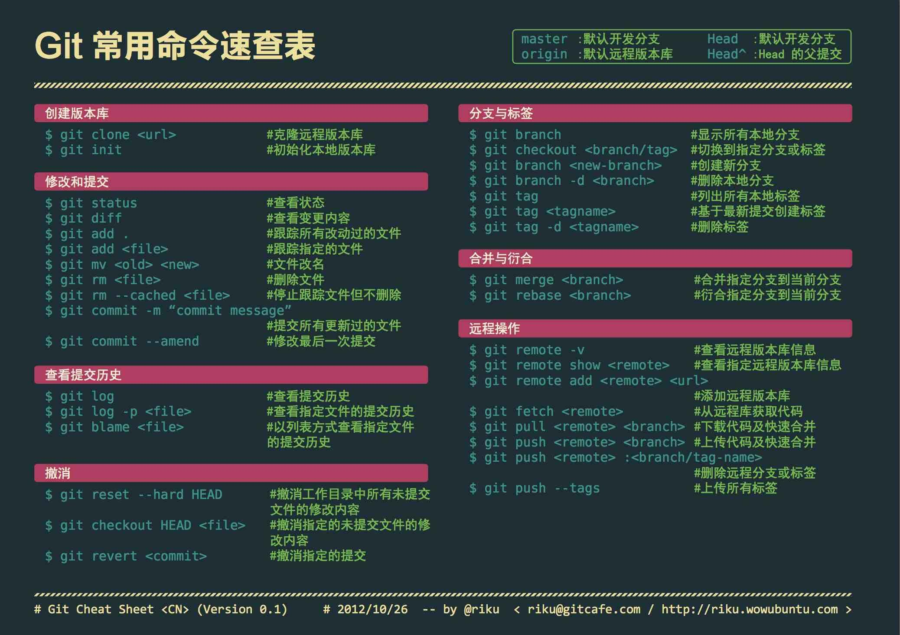

# Git

#### **查看历史记录并移动**

​    git log
​    git log --oneline
​    git reflog

    git reset --hard /mixed/soft

#### **帮助**

​    git help 

#### **状态**

​    git status 

#### **分支**

​    查看分支 git branch -v
​    创建分支 git branch [name]
​    切换分支 git checkout [name]
​    合并分支 git merge [banch name]

#### **解决冲突**

​    git add [name]
​    git commit -m "name"

#### **远程**

    git push
    git fetch
    git merge
    git pull
#### 1.git首次使用

##### 全局配置

```
git config --global user.name "your name"
git config --global user.email "your email" 
```

##### 生成秘钥

```
ssh-keygen -t rsa -C "your email"
```

##### 密钥位置

```
生成文件：
	id_rsa、id_rsa.pub
windows：
	C:\Users\Administrator\.ssh\id_rsa.pub
unix:
	~/.ssh/id_rsa.pub
```

## 使用流程

```
1.git clone
2.每次使用前git pull一下
3.开发
4.git commit
5.git pull(合并远端)
6.git rebase
7.git push
```

