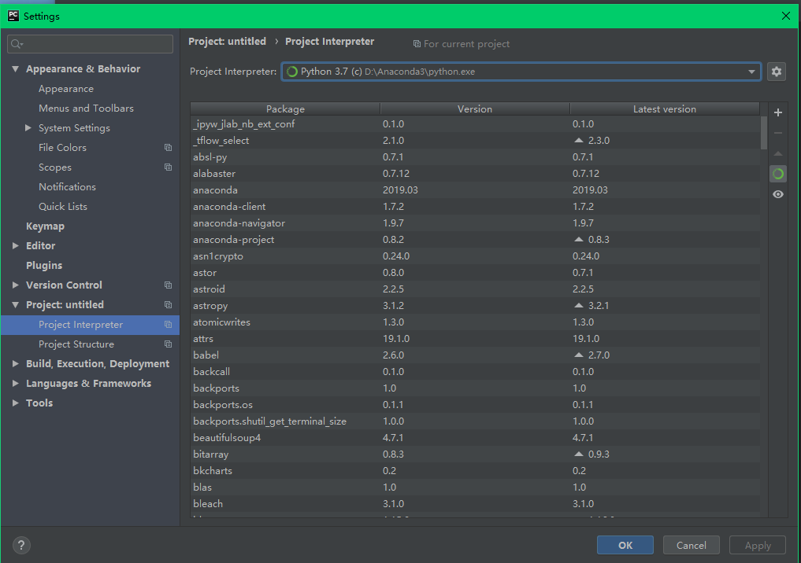
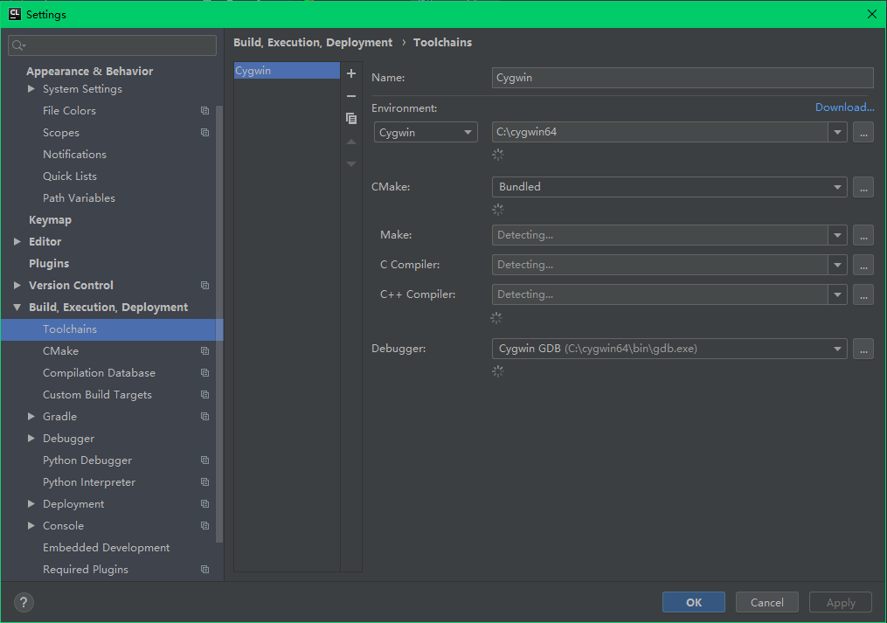
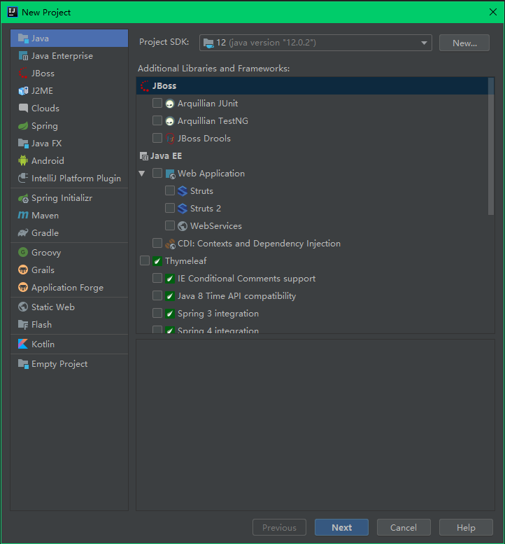

# Pycharm、Clion、Idea使用

## 1.配置环境

### 1.1 Pycharm

1.安装[anaconda](https://mirrors.tuna.tsinghua.edu.cn/help/AOSP/)

```
https://www.anaconda.com/distribution/#download-section	//官网
https://mirrors.tuna.tsinghua.edu.cn/help/AOSP/		//清华源
```

2.安装[Pycharm](http://www.jetbrains.com/pycharm/download/)

```
http://www.jetbrains.com/pycharm/download/
```

3.配置

点击file->Setting->project interpreter->show all->+->existing enviroment

添加anaconda的安装路径

```
D:\Anaconda3\python.exe
```



4.mac和linux安装方法类似

### 1.2 Clion

1.安装[Cygwin](https://cygwin.com/install.html)

```
https://cygwin.com/install.html
```

2.配置环境

勾选以下项目安装

```
gcc-core gcc-g++ make cmake gdb binutils
```


3.安装[Clion](https://www.jetbrains.com/clion/)

```
https://www.jetbrains.com/clion/
```

4.配置

点击file->Setting->Toolchain->+->Cygwin

会自动找到所需要的项目点击应用



### 1.3 Idea

1.安装[jdk](https://www.oracle.com/technetwork/java/javase/downloads/jdk12-downloads-5295953.html)

```
https://www.oracle.com/technetwork/java/javase/downloads/jdk12-downloads-5295953.html
```

2.配置

Project SDK选择就好



## 2.使用技巧

### 2.1快捷键

| 快捷键          | 功能             |
| --------------- | ---------------- |
| ctrl+shift+n    | 精确定位文件     |
| ctrl+j          | 调出模板         |
| F11             | 增加删除标签     |
| F2              | 定位错误行       |
| shift+F11       | 显示所有标签     |
| ctrl+F11        | 命名标签         |
| ctrl+q          | 快速查看函数文档 |
| ctrl+shift+i    | 快速展示源码     |
| alt+6           | TODO             |
| ctrl+/          | 注释             |
| ctrl+.          | 代码折叠         |
| ctlr+shift+ +/- | 代码折叠         |
| shift+F6        | refactor         |

### 2.2插件

1.autopep8

安装这个工具

```
sudo pip install autopep8
```

在pycharm的external tool里导入

```
Name:AutoPep8
Description:autopep8 your code
Program: anaconda3/lib/python3.7/site-packages/autopep8.py
Arguments:--in-place --aggressive $FilePath$
Working directory:$ProjectFileDir$
OutPut filter:$FILE_PATH$\:$LINES$\:$COLUMNS$\:.*
```

2.ideavim

3.aiXcoder

## 激活码

```
ZKVVPH4MIO-eyJsaWNlbnNlSWQiOiJaS1ZWUEg0TUlPIiwibGljZW5zZWVOYW1lIjoi5o6I5p2D5Luj55CG5ZWGIGh0dHA6Ly9pZGVhLmhrLmNuIiwiYXNzaWduZWVOYW1lIjoiIiwiYXNzaWduZWVFbWFpbCI6IiIsImxpY2Vuc2VSZXN0cmljdGlvbiI6IiIsImNoZWNrQ29uY3VycmVudFVzZSI6ZmFsc2UsInByb2R1Y3RzIjpbeyJjb2RlIjoiSUkiLCJmYWxsYmFja0RhdGUiOiIyMDE5LTA3LTAxIiwicGFpZFVwVG8iOiIyMDIwLTA2LTMwIn0seyJjb2RlIjoiQUMiLCJmYWxsYmFja0RhdGUiOiIyMDE5LTA3LTAxIiwicGFpZFVwVG8iOiIyMDIwLTA2LTMwIn0seyJjb2RlIjoiRFBOIiwiZmFsbGJhY2tEYXRlIjoiMjAxOS0wNy0wMSIsInBhaWRVcFRvIjoiMjAyMC0wNi0zMCJ9LHsiY29kZSI6IlBTIiwiZmFsbGJhY2tEYXRlIjoiMjAxOS0wNy0wMSIsInBhaWRVcFRvIjoiMjAyMC0wNi0zMCJ9LHsiY29kZSI6IkdPIiwiZmFsbGJhY2tEYXRlIjoiMjAxOS0wNy0wMSIsInBhaWRVcFRvIjoiMjAyMC0wNi0zMCJ9LHsiY29kZSI6IkRNIiwiZmFsbGJhY2tEYXRlIjoiMjAxOS0wNy0wMSIsInBhaWRVcFRvIjoiMjAyMC0wNi0zMCJ9LHsiY29kZSI6IkNMIiwiZmFsbGJhY2tEYXRlIjoiMjAxOS0wNy0wMSIsInBhaWRVcFRvIjoiMjAyMC0wNi0zMCJ9LHsiY29kZSI6IlJTMCIsImZhbGxiYWNrRGF0ZSI6IjIwMTktMDctMDEiLCJwYWlkVXBUbyI6IjIwMjAtMDYtMzAifSx7ImNvZGUiOiJSQyIsImZhbGxiYWNrRGF0ZSI6IjIwMTktMDctMDEiLCJwYWlkVXBUbyI6IjIwMjAtMDYtMzAifSx7ImNvZGUiOiJSRCIsImZhbGxiYWNrRGF0ZSI6IjIwMTktMDctMDEiLCJwYWlkVXBUbyI6IjIwMjAtMDYtMzAifSx7ImNvZGUiOiJQQyIsImZhbGxiYWNrRGF0ZSI6IjIwMTktMDctMDEiLCJwYWlkVXBUbyI6IjIwMjAtMDYtMzAifSx7ImNvZGUiOiJSTSIsImZhbGxiYWNrRGF0ZSI6IjIwMTktMDctMDEiLCJwYWlkVXBUbyI6IjIwMjAtMDYtMzAifSx7ImNvZGUiOiJXUyIsImZhbGxiYWNrRGF0ZSI6IjIwMTktMDctMDEiLCJwYWlkVXBUbyI6IjIwMjAtMDYtMzAifSx7ImNvZGUiOiJEQiIsImZhbGxiYWNrRGF0ZSI6IjIwMTktMDctMDEiLCJwYWlkVXBUbyI6IjIwMjAtMDYtMzAifSx7ImNvZGUiOiJEQyIsImZhbGxiYWNrRGF0ZSI6IjIwMTktMDctMDEiLCJwYWlkVXBUbyI6IjIwMjAtMDYtMzAifSx7ImNvZGUiOiJSU1UiLCJmYWxsYmFja0RhdGUiOiIyMDE5LTA3LTAxIiwicGFpZFVwVG8iOiIyMDIwLTA2LTMwIn1dLCJoYXNoIjoiMTM1NTgzMjIvMCIsImdyYWNlUGVyaW9kRGF5cyI6NywiYXV0b1Byb2xvbmdhdGVkIjpmYWxzZSwiaXNBdXRvUHJvbG9uZ2F0ZWQiOmZhbHNlfQ==-i/ZK8vfXLX80OFpkhwEo9QxMhsWaOu3SfBmNPup63N0kjM2XBIoR67s8fk0Li45CreS2zQcPZdypLPeyRrdrUYGTw77tkK/kUygxEwRKauqgdJhUs+881TGitcmZvk8obLXjjpv+tZEbV31ee6Fb2/iuK36Q1NCuhKGlo8mA68kGXLOk5ppRYCqQUnHY2zk8spzxC/yJtG+JAQGlPDyvQmkQ5taRxM77b1/v2/62t5Xa2HqnPkuJBrS+XXuGz++RBuYEv6cVe5hmsUaQJZe9/Z4BrhMy48fVEG6bsKTmJ4yILs9sSyUM6uA05AOm8lXWmCG3m9AdVyawsWqBJIn7Rw==-MIIElTCCAn2gAwIBAgIBCTANBgkqhkiG9w0BAQsFADAYMRYwFAYDVQQDDA1KZXRQcm9maWxlIENBMB4XDTE4MTEwMTEyMjk0NloXDTIwMTEwMjEyMjk0NlowaDELMAkGA1UEBhMCQ1oxDjAMBgNVBAgMBU51c2xlMQ8wDQYDVQQHDAZQcmFndWUxGTAXBgNVBAoMEEpldEJyYWlucyBzLnIuby4xHTAbBgNVBAMMFHByb2QzeS1mcm9tLTIwMTgxMTAxMIIBIjANBgkqhkiG9w0BAQEFAAOCAQ8AMIIBCgKCAQEAxcQkq+zdxlR2mmRYBPzGbUNdMN6OaXiXzxIWtMEkrJMO/5oUfQJbLLuMSMK0QHFmaI37WShyxZcfRCidwXjot4zmNBKnlyHodDij/78TmVqFl8nOeD5+07B8VEaIu7c3E1N+e1doC6wht4I4+IEmtsPAdoaj5WCQVQbrI8KeT8M9VcBIWX7fD0fhexfg3ZRt0xqwMcXGNp3DdJHiO0rCdU+Itv7EmtnSVq9jBG1usMSFvMowR25mju2JcPFp1+I4ZI+FqgR8gyG8oiNDyNEoAbsR3lOpI7grUYSvkB/xVy/VoklPCK2h0f0GJxFjnye8NT1PAywoyl7RmiAVRE/EKwIDAQABo4GZMIGWMAkGA1UdEwQCMAAwHQYDVR0OBBYEFGEpG9oZGcfLMGNBkY7SgHiMGgTcMEgGA1UdIwRBMD+AFKOetkhnQhI2Qb1t4Lm0oFKLl/GzoRykGjAYMRYwFAYDVQQDDA1KZXRQcm9maWxlIENBggkA0myxg7KDeeEwEwYDVR0lBAwwCgYIKwYBBQUHAwEwCwYDVR0PBAQDAgWgMA0GCSqGSIb3DQEBCwUAA4ICAQAF8uc+YJOHHwOFcPzmbjcxNDuGoOUIP+2h1R75Lecswb7ru2LWWSUMtXVKQzChLNPn/72W0k+oI056tgiwuG7M49LXp4zQVlQnFmWU1wwGvVhq5R63Rpjx1zjGUhcXgayu7+9zMUW596Lbomsg8qVve6euqsrFicYkIIuUu4zYPndJwfe0YkS5nY72SHnNdbPhEnN8wcB2Kz+OIG0lih3yz5EqFhld03bGp222ZQCIghCTVL6QBNadGsiN/lWLl4JdR3lJkZzlpFdiHijoVRdWeSWqM4y0t23c92HXKrgppoSV18XMxrWVdoSM3nuMHwxGhFyde05OdDtLpCv+jlWf5REAHHA201pAU6bJSZINyHDUTB+Beo28rRXSwSh3OUIvYwKNVeoBY+KwOJ7WnuTCUq1meE6GkKc4D/cXmgpOyW/1SmBz3XjVIi/zprZ0zf3qH5mkphtg6ksjKgKjmx1cXfZAAX6wcDBNaCL+Ortep1Dh8xDUbqbBVNBL4jbiL3i3xsfNiyJgaZ5sX7i8tmStEpLbPwvHcByuf59qJhV/bZOl8KqJBETCDJcY6O2aqhTUy+9x93ThKs1GKrRPePrWPluud7ttlgtRveit/pcBrnQcXOl1rHq7ByB8CFAxNotRUYL9IF5n3wJOgkPojMy6jetQA5Ogc8Sm7RG6vg1yow== 
```

```
D6KY031L1G-eyJsaWNlbnNlSWQiOiJENktZMDMxTDFHIiwibGljZW5zZWVOYW1lIjoi5o6I5p2D5Luj55CG5ZWGOiB3d3cuaTkub3JnIiwiYXNzaWduZWVOYW1lIjoiIiwiYXNzaWduZWVFbWFpbCI6IiIsImxpY2Vuc2VSZXN0cmljdGlvbiI6IiIsImNoZWNrQ29uY3VycmVudFVzZSI6ZmFsc2UsInByb2R1Y3RzIjpbeyJjb2RlIjoiSUkiLCJmYWxsYmFja0RhdGUiOiIyMDE5LTA3LTIyIiwicGFpZFVwVG8iOiIyMDIwLTA3LTIxIn0seyJjb2RlIjoiQUMiLCJmYWxsYmFja0RhdGUiOiIyMDE5LTA3LTIyIiwicGFpZFVwVG8iOiIyMDIwLTA3LTIxIn0seyJjb2RlIjoiRFBOIiwiZmFsbGJhY2tEYXRlIjoiMjAxOS0wNy0yMiIsInBhaWRVcFRvIjoiMjAyMC0wNy0yMSJ9LHsiY29kZSI6IlBTIiwiZmFsbGJhY2tEYXRlIjoiMjAxOS0wNy0yMiIsInBhaWRVcFRvIjoiMjAyMC0wNy0yMSJ9LHsiY29kZSI6IkdPIiwiZmFsbGJhY2tEYXRlIjoiMjAxOS0wNy0yMiIsInBhaWRVcFRvIjoiMjAyMC0wNy0yMSJ9LHsiY29kZSI6IkRNIiwiZmFsbGJhY2tEYXRlIjoiMjAxOS0wNy0yMiIsInBhaWRVcFRvIjoiMjAyMC0wNy0yMSJ9LHsiY29kZSI6IkNMIiwiZmFsbGJhY2tEYXRlIjoiMjAxOS0wNy0yMiIsInBhaWRVcFRvIjoiMjAyMC0wNy0yMSJ9LHsiY29kZSI6IlJTMCIsImZhbGxiYWNrRGF0ZSI6IjIwMTktMDctMjIiLCJwYWlkVXBUbyI6IjIwMjAtMDctMjEifSx7ImNvZGUiOiJSQyIsImZhbGxiYWNrRGF0ZSI6IjIwMTktMDctMjIiLCJwYWlkVXBUbyI6IjIwMjAtMDctMjEifSx7ImNvZGUiOiJSRCIsImZhbGxiYWNrRGF0ZSI6IjIwMTktMDctMjIiLCJwYWlkVXBUbyI6IjIwMjAtMDctMjEifSx7ImNvZGUiOiJQQyIsImZhbGxiYWNrRGF0ZSI6IjIwMTktMDctMjIiLCJwYWlkVXBUbyI6IjIwMjAtMDctMjEifSx7ImNvZGUiOiJSTSIsImZhbGxiYWNrRGF0ZSI6IjIwMTktMDctMjIiLCJwYWlkVXBUbyI6IjIwMjAtMDctMjEifSx7ImNvZGUiOiJXUyIsImZhbGxiYWNrRGF0ZSI6IjIwMTktMDctMjIiLCJwYWlkVXBUbyI6IjIwMjAtMDctMjEifSx7ImNvZGUiOiJEQiIsImZhbGxiYWNrRGF0ZSI6IjIwMTktMDctMjIiLCJwYWlkVXBUbyI6IjIwMjAtMDctMjEifSx7ImNvZGUiOiJEQyIsImZhbGxiYWNrRGF0ZSI6IjIwMTktMDctMjIiLCJwYWlkVXBUbyI6IjIwMjAtMDctMjEifSx7ImNvZGUiOiJSU1UiLCJmYWxsYmFja0RhdGUiOiIyMDE5LTA3LTIyIiwicGFpZFVwVG8iOiIyMDIwLTA3LTIxIn1dLCJoYXNoIjoiMTM3ODQzMjAvMCIsImdyYWNlUGVyaW9kRGF5cyI6NywiYXV0b1Byb2xvbmdhdGVkIjpmYWxzZSwiaXNBdXRvUHJvbG9uZ2F0ZWQiOmZhbHNlfQ==-hBov92HEvNGvBzS2z190KAPxc9F6XY6jT1daMLlPrpCSEAdQX/955WkyGz+hCa3w/aeNExMEZIv2tALkFDOt857w4PZM8oYZ07s7My1NL7DxX9coFswbC6IIBijkAne9cPV9fSnGt5XcfsAkrF8KW1gj21H4EZGR6Jm4Cn7/j37rG1ASu2uvdoJ4dgCicfi78fvIw+zVvGm7L4cMjsmsilNNrUFPpDuVCp2kfU2ncDWm/M0lu+Dfeo3UO61/ICs9FvYAw0V4d8Q6pExzoqbAGH0IgkrHKJ2YQpKKOz3/+w4SGKhAX+85XYmfmLcUoqAZWaI95yhXN/czf/eeAf3ZEg==-MIIElTCCAn2gAwIBAgIBCTANBgkqhkiG9w0BAQsFADAYMRYwFAYDVQQDDA1KZXRQcm9maWxlIENBMB4XDTE4MTEwMTEyMjk0NloXDTIwMTEwMjEyMjk0NlowaDELMAkGA1UEBhMCQ1oxDjAMBgNVBAgMBU51c2xlMQ8wDQYDVQQHDAZQcmFndWUxGTAXBgNVBAoMEEpldEJyYWlucyBzLnIuby4xHTAbBgNVBAMMFHByb2QzeS1mcm9tLTIwMTgxMTAxMIIBIjANBgkqhkiG9w0BAQEFAAOCAQ8AMIIBCgKCAQEAxcQkq+zdxlR2mmRYBPzGbUNdMN6OaXiXzxIWtMEkrJMO/5oUfQJbLLuMSMK0QHFmaI37WShyxZcfRCidwXjot4zmNBKnlyHodDij/78TmVqFl8nOeD5+07B8VEaIu7c3E1N+e1doC6wht4I4+IEmtsPAdoaj5WCQVQbrI8KeT8M9VcBIWX7fD0fhexfg3ZRt0xqwMcXGNp3DdJHiO0rCdU+Itv7EmtnSVq9jBG1usMSFvMowR25mju2JcPFp1+I4ZI+FqgR8gyG8oiNDyNEoAbsR3lOpI7grUYSvkB/xVy/VoklPCK2h0f0GJxFjnye8NT1PAywoyl7RmiAVRE/EKwIDAQABo4GZMIGWMAkGA1UdEwQCMAAwHQYDVR0OBBYEFGEpG9oZGcfLMGNBkY7SgHiMGgTcMEgGA1UdIwRBMD+AFKOetkhnQhI2Qb1t4Lm0oFKLl/GzoRykGjAYMRYwFAYDVQQDDA1KZXRQcm9maWxlIENBggkA0myxg7KDeeEwEwYDVR0lBAwwCgYIKwYBBQUHAwEwCwYDVR0PBAQDAgWgMA0GCSqGSIb3DQEBCwUAA4ICAQAF8uc+YJOHHwOFcPzmbjcxNDuGoOUIP+2h1R75Lecswb7ru2LWWSUMtXVKQzChLNPn/72W0k+oI056tgiwuG7M49LXp4zQVlQnFmWU1wwGvVhq5R63Rpjx1zjGUhcXgayu7+9zMUW596Lbomsg8qVve6euqsrFicYkIIuUu4zYPndJwfe0YkS5nY72SHnNdbPhEnN8wcB2Kz+OIG0lih3yz5EqFhld03bGp222ZQCIghCTVL6QBNadGsiN/lWLl4JdR3lJkZzlpFdiHijoVRdWeSWqM4y0t23c92HXKrgppoSV18XMxrWVdoSM3nuMHwxGhFyde05OdDtLpCv+jlWf5REAHHA201pAU6bJSZINyHDUTB+Beo28rRXSwSh3OUIvYwKNVeoBY+KwOJ7WnuTCUq1meE6GkKc4D/cXmgpOyW/1SmBz3XjVIi/zprZ0zf3qH5mkphtg6ksjKgKjmx1cXfZAAX6wcDBNaCL+Ortep1Dh8xDUbqbBVNBL4jbiL3i3xsfNiyJgaZ5sX7i8tmStEpLbPwvHcByuf59qJhV/bZOl8KqJBETCDJcY6O2aqhTUy+9x93ThKs1GKrRPePrWPluud7ttlgtRveit/pcBrnQcXOl1rHq7ByB8CFAxNotRUYL9IF5n3wJOgkPojMy6jetQA5Ogc8Sm7RG6vg1yow==
```

```
AHD9079DKZ-eyJsaWNlbnNlSWQiOiJBSEQ5MDc5REtaIiwibGljZW5zZWVOYW1lIjoiSmV0IEdyb3VwcyIsImFzc2lnbmVlTmFtZSI6IiIsImFzc2lnbmVlRW1haWwiOiIiLCJsaWNlbnNlUmVzdHJpY3Rpb24iOiIiLCJjaGVja0NvbmN1cnJlbnRVc2UiOmZhbHNlLCJwcm9kdWN0cyI6W3siY29kZSI6IklJIiwiZmFsbGJhY2tEYXRlIjoiMjAxOS0xMi0xNCIsInBhaWRVcFRvIjoiMjAyMC0xMi0xMyJ9LHsiY29kZSI6IkFDIiwiZmFsbGJhY2tEYXRlIjoiMjAxOS0xMi0xNCIsInBhaWRVcFRvIjoiMjAyMC0xMi0xMyJ9LHsiY29kZSI6IkRQTiIsImZhbGxiYWNrRGF0ZSI6IjIwMTktMTItMTQiLCJwYWlkVXBUbyI6IjIwMjAtMTItMTMifSx7ImNvZGUiOiJQUyIsImZhbGxiYWNrRGF0ZSI6IjIwMTktMTItMTQiLCJwYWlkVXBUbyI6IjIwMjAtMTItMTMifSx7ImNvZGUiOiJHTyIsImZhbGxiYWNrRGF0ZSI6IjIwMTktMTItMTQiLCJwYWlkVXBUbyI6IjIwMjAtMTItMTMifSx7ImNvZGUiOiJETSIsImZhbGxiYWNrRGF0ZSI6IjIwMTktMTItMTQiLCJwYWlkVXBUbyI6IjIwMjAtMTItMTMifSx7ImNvZGUiOiJDTCIsImZhbGxiYWNrRGF0ZSI6IjIwMTktMTItMTQiLCJwYWlkVXBUbyI6IjIwMjAtMTItMTMifSx7ImNvZGUiOiJSUzAiLCJmYWxsYmFja0RhdGUiOiIyMDE5LTEyLTE0IiwicGFpZFVwVG8iOiIyMDIwLTEyLTEzIn0seyJjb2RlIjoiUkMiLCJmYWxsYmFja0RhdGUiOiIyMDE5LTEyLTE0IiwicGFpZFVwVG8iOiIyMDIwLTEyLTEzIn0seyJjb2RlIjoiUkQiLCJmYWxsYmFja0RhdGUiOiIyMDE5LTEyLTE0IiwicGFpZFVwVG8iOiIyMDIwLTEyLTEzIn0seyJjb2RlIjoiUEMiLCJmYWxsYmFja0RhdGUiOiIyMDE5LTEyLTE0IiwicGFpZFVwVG8iOiIyMDIwLTEyLTEzIn0seyJjb2RlIjoiUk0iLCJmYWxsYmFja0RhdGUiOiIyMDE5LTEyLTE0IiwicGFpZFVwVG8iOiIyMDIwLTEyLTEzIn0seyJjb2RlIjoiV1MiLCJmYWxsYmFja0RhdGUiOiIyMDE5LTEyLTE0IiwicGFpZFVwVG8iOiIyMDIwLTEyLTEzIn0seyJjb2RlIjoiREIiLCJmYWxsYmFja0RhdGUiOiIyMDE5LTEyLTE0IiwicGFpZFVwVG8iOiIyMDIwLTEyLTEzIn0seyJjb2RlIjoiREMiLCJmYWxsYmFja0RhdGUiOiIyMDE5LTEyLTE0IiwicGFpZFVwVG8iOiIyMDIwLTEyLTEzIn0seyJjb2RlIjoiUlNVIiwiZmFsbGJhY2tEYXRlIjoiMjAxOS0xMi0xNCIsInBhaWRVcFRvIjoiMjAyMC0xMi0xMyJ9XSwiaGFzaCI6IjE1ODE1MDAyLzAiLCJncmFjZVBlcmlvZERheXMiOjcsImF1dG9Qcm9sb25nYXRlZCI6ZmFsc2UsImlzQXV0b1Byb2xvbmdhdGVkIjpmYWxzZX0=-LSd4oz1ZeZGTkNgA7KqUD6dmIqKNRaJEiAdpNBN3rw86DnEZm6oUoTMdM40mxRG0jz5RpLR8E6/A2uA2b9s6fX3U1dAhzuJ7HUpha2OCk9EnYGlIoxnMmYA+ZrCjlfLU2EsLMPcmKHAY5o2excxpbIqLYsNhXN3r2MxEtvGap9Y+hBxNJJYoYjV5glFIiJ/9NNAE6s1EqRRlQk2UpFg2ODDlK1JZrQTtIJvH9squs1IFz0fY9i/okXIyR4fCUbU2LUp5XbtMn3n2lKb2mEKDWjjSly3cZizAGz7obIixE1HZuEICEPWeAZiU8qc/adRt7eUYW81KFdYjLNDXcVckbw==-MIIElTCCAn2gAwIBAgIBCTANBgkqhkiG9w0BAQsFADAYMRYwFAYDVQQDDA1KZXRQcm9maWxlIENBMB4XDTE4MTEwMTEyMjk0NloXDTIwMTEwMjEyMjk0NlowaDELMAkGA1UEBhMCQ1oxDjAMBgNVBAgMBU51c2xlMQ8wDQYDVQQHDAZQcmFndWUxGTAXBgNVBAoMEEpldEJyYWlucyBzLnIuby4xHTAbBgNVBAMMFHByb2QzeS1mcm9tLTIwMTgxMTAxMIIBIjANBgkqhkiG9w0BAQEFAAOCAQ8AMIIBCgKCAQEAxcQkq+zdxlR2mmRYBPzGbUNdMN6OaXiXzxIWtMEkrJMO/5oUfQJbLLuMSMK0QHFmaI37WShyxZcfRCidwXjot4zmNBKnlyHodDij/78TmVqFl8nOeD5+07B8VEaIu7c3E1N+e1doC6wht4I4+IEmtsPAdoaj5WCQVQbrI8KeT8M9VcBIWX7fD0fhexfg3ZRt0xqwMcXGNp3DdJHiO0rCdU+Itv7EmtnSVq9jBG1usMSFvMowR25mju2JcPFp1+I4ZI+FqgR8gyG8oiNDyNEoAbsR3lOpI7grUYSvkB/xVy/VoklPCK2h0f0GJxFjnye8NT1PAywoyl7RmiAVRE/EKwIDAQABo4GZMIGWMAkGA1UdEwQCMAAwHQYDVR0OBBYEFGEpG9oZGcfLMGNBkY7SgHiMGgTcMEgGA1UdIwRBMD+AFKOetkhnQhI2Qb1t4Lm0oFKLl/GzoRykGjAYMRYwFAYDVQQDDA1KZXRQcm9maWxlIENBggkA0myxg7KDeeEwEwYDVR0lBAwwCgYIKwYBBQUHAwEwCwYDVR0PBAQDAgWgMA0GCSqGSIb3DQEBCwUAA4ICAQAF8uc+YJOHHwOFcPzmbjcxNDuGoOUIP+2h1R75Lecswb7ru2LWWSUMtXVKQzChLNPn/72W0k+oI056tgiwuG7M49LXp4zQVlQnFmWU1wwGvVhq5R63Rpjx1zjGUhcXgayu7+9zMUW596Lbomsg8qVve6euqsrFicYkIIuUu4zYPndJwfe0YkS5nY72SHnNdbPhEnN8wcB2Kz+OIG0lih3yz5EqFhld03bGp222ZQCIghCTVL6QBNadGsiN/lWLl4JdR3lJkZzlpFdiHijoVRdWeSWqM4y0t23c92HXKrgppoSV18XMxrWVdoSM3nuMHwxGhFyde05OdDtLpCv+jlWf5REAHHA201pAU6bJSZINyHDUTB+Beo28rRXSwSh3OUIvYwKNVeoBY+KwOJ7WnuTCUq1meE6GkKc4D/cXmgpOyW/1SmBz3XjVIi/zprZ0zf3qH5mkphtg6ksjKgKjmx1cXfZAAX6wcDBNaCL+Ortep1Dh8xDUbqbBVNBL4jbiL3i3xsfNiyJgaZ5sX7i8tmStEpLbPwvHcByuf59qJhV/bZOl8KqJBETCDJcY6O2aqhTUy+9x93ThKs1GKrRPePrWPluud7ttlgtRveit/pcBrnQcXOl1rHq7ByB8CFAxNotRUYL9IF5n3wJOgkPojMy6jetQA5Ogc8Sm7RG6vg1yow== 
```

```
http://pc.xz.cn/
IDESSVWEYX173904
```


## 3.配置远端服务器docker环境

以tensorflow为例,服务器需要docker和显卡驱动

1.登录服务器

```
ssh 用户名@ip -p 端口
```

2.安装容器

```
docker pull tensorflow/tensorflow:latest-gpu-py3-jupyter
```

```
docker run -it --name tfgpu -p 1111:8888 -p 2222:22 -v /temp:/temp tensorflow/tensorflow:latest-gpu-py3-jupyter
```

1111是jupyter的映射端口,2222是sftp/ssh的映射端口

```
docker exec -it tfgpu bash
```

3.配置jupyter

```
jupyter notebook --notebook-dir=/tf --ip 0.0.0.0 --no-browser --allow-root
```

```
jupyter notebook password
```

重启jupyter

```
jobs
bg 1
```

4.配置ssh

```
sudo apt-get update
sudo apt-get install openssh-server
vi /etc/ssh/sshd_config
修改 PermitRootLogin yes
/etc/init.d/ssh start
ps aux|grep ssh
```

去除 登录信息,可以解决sftp登录返回数据过长问题

```
 vi /etc/bash.bashrc 
 # 去除多余的echo信息
 source /etc/bash.bashrc
```

5.修改root密码

```
passwd
```

6.配置ide

```
add interpreter - >ssh interpreter 
```

```
docker run -itd --runtime=nvidia --name tf1 -p 9616:8888 -p 9626:22 -v /home/xwx/tf1:/tf1 -v /home/xwx/notebook/tf1:/tf tfpu1:ssh

docker run -itd --runtime=nvidia --name tf2 -p 9617:8888 -p 9627:22 -v /home/xwx/tf2:/tf2 -v /home/xwx/notebook/tf2:/tf tfpu2:ssh
```

